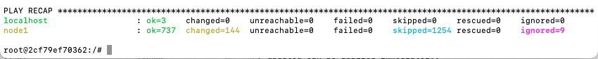
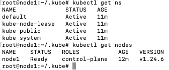
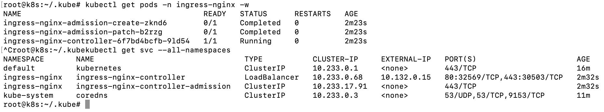
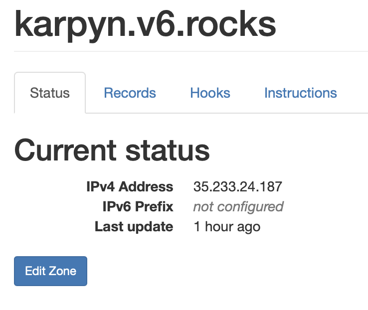
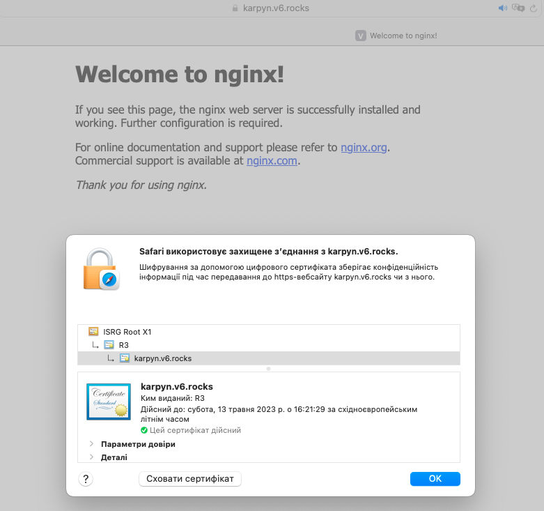

# Task3.-K8S
### 1. Deployment of K8S using kubesprey

According to the [following](https://docs.google.com/document/d/11-mHm1BWdKFaEm9HdaeALvvulKDESyGm/edit) instruction was created VM on GCP and deployed K8S through kube-spray:



As result, running K8S with installed node:



### 2. Installing Ingress-controller on KS8
According to the official [documentation](https://kubernetes.github.io/ingress-nginx/deploy/) runing the command
```
kubectl apply -f https://raw.githubusercontent.com/kubernetes/ingress-nginx/controller-v1.5.1/deploy/static/provider/cloud/deploy.yaml
```
As the result, we installed Nginx Ingress-controller



### 3.1 Creating and registering a domain name on  https://dynv6.com/
   
   
### 3.2 Configuring cert-manager (https://cert-manager.io/) with Letsencrypt

Following official [documentation](https://cert-manager.io/docs/installation/)

Installing cert-manager
```
kubectl apply -f https://github.com/cert-manager/cert-manager/releases/download/v1.11.0/cert-manager.yaml
```
Configure a Let's Encrypt Issuer with [Letsencript.yaml](Letsencript.yaml)
``` 
kubectl apply -f Letsencript.yaml 
```
### 4. Prepare Nginx deployment:
Deployment
Service
Ingress (which will be connected to ClusterIssuer and use the Letsencrypt certificate)

Preparing and Deploying [Deployment.yaml](Deployment.yaml) where we specify Nginx server, Service for configuring ports and Ingress for configuring connection to clusterissuer that use letsencrypt certificate.
```
kubectl apply -f Deployment.yaml
```

As result, we had a [host](https://karpyn.v6.rocks) that is accessible through HTTPS

